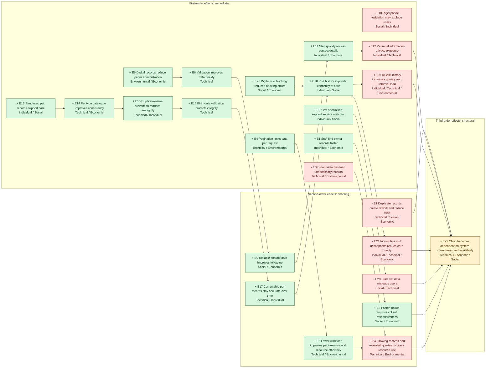

# Sustainability Awareness Diagram

This diagram is based on the prioritized effects in `MD/prioritized-chain-of-effects.md`. It follows the Sustainability Awareness Framework structure from the course slides: effects are grouped by sustainability dimension and by order of effect.

Legend:

- `+` positive effect
- `-` negative effect
- `~` mixed effect
- First order: immediate effect from system use
- Second order: enabling effect over continued use
- Third order: structural long-term effect

## SusAD Matrix

| Dimension | First-order effects | Second-order effects | Third-order effects |
|---|---|---|---|
| Individual | `+ E1` Staff find owner records faster.  `- E10` Rigid phone validation may exclude valid phone formats.  `+ E11` Staff quickly access owner contact information.  `- E12` Personal information is exposed on-screen.  `+ E13` Structured pet records support continuity of care.  `+ E15` Duplicate-name prevention reduces wrong-pet selection.  `+ E18` Visit history supports continuity of care.  `+ E22` Vet specialties help users identify suitable vets. | `+ E17` Correctable pet records keep clinical information accurate.  `- E21` Incomplete visit descriptions reduce care quality and create rework. | `~ E25` Clinic becomes dependent on the system for day-to-day operations. |
| Social | `+ E13` Structured pet records support continuity of care.  `+ E18` Visit history supports continuity of care.  `+ E20` Digital visit booking reduces verbal or paper booking errors.  `+ E22` Vet specialties help users identify suitable vets. | `+ E2` Faster lookup improves client service responsiveness.  `- E7` Incorrect or duplicate records reduce record trust.  `+ E9` Reliable contact data improves follow-up communication.  `- E23` Stale vet specialty data misleads users and reduces trust. | `~ E25` Users rely on the system as an authoritative source for clinic operations. |
| Environmental | `- E3` Broad searches can load unnecessary records.  `+ E4` Pagination limits data returned and rendered per request.  `+ E6` Digital records reduce paper-based administration.  `- E19` Full visit history can increase data retrieval workload. | `+ E5` Lower per-request workload improves performance and resource efficiency.  `- E24` Growing records and repeated queries increase maintenance and resource use. | |
| Economic | `+ E1` Faster record lookup saves staff time.  `+ E6` Digital records reduce administrative cost.  `+ E11` Fast contact access improves staff workflow.  `+ E14` Standardized pet types improve reporting.  `+ E20` Digital visit booking reduces booking errors. | `+ E2` Better responsiveness improves client service.  `- E7` Duplicate records create rework.  `+ E9` Reliable contact data improves follow-up.  `- E21` Incomplete visit notes create rework. | `~ E25` Operational dependence creates value but also business continuity risk. |
| Technical | `- E3` Broad searches can load unnecessary records.  `+ E4` Pagination limits per-request data.  `+ E8` Validation improves data quality.  `- E12` Privacy exposure risk must be managed technically.  `+ E14` Catalogue-based types improve consistency.  `+ E15` Duplicate-name prevention reduces ambiguity.  `+ E16` Birth-date validation protects data integrity.  `- E19` Visit history display increases retrieval workload. | `+ E5` Lower request workload improves performance.  `- E7` Duplicate records reduce data trust.  `+ E17` Editable pet details preserve accuracy.  `- E21` Incomplete descriptions reduce record usefulness.  `- E23` Stale vet data reduces trust and maintainability.  `- E24` Growing records increase maintenance and resource use. | `~ E25` System correctness, availability, and maintainability become structurally important. |

## Mermaid Diagram

Paste this Mermaid block into a Mermaid renderer, GitHub Markdown preview, or a diagramming tool that supports Mermaid.

## Report-Ready Summary

The diagram shows that Spring PetClinic's strongest positive sustainability chain starts with structured digital owner, pet, and visit records. These immediate technical improvements improve data quality, staff responsiveness, communication, and continuity of care. Over time, these effects support social trust and economic efficiency.

The strongest negative chain comes from the same digital dependence. Personal information and visit histories become easier to access, creating privacy risk. Growing records and repeated database queries also increase technical maintenance and resource use. The main third-order effect is that the clinic becomes structurally dependent on system correctness, availability, privacy protection, and maintainability.

The highest-priority mitigation actions are to preserve pagination, protect personal data, maintain vet and pet records accurately, improve validation without excluding legitimate users, and monitor database/query performance as records grow.
